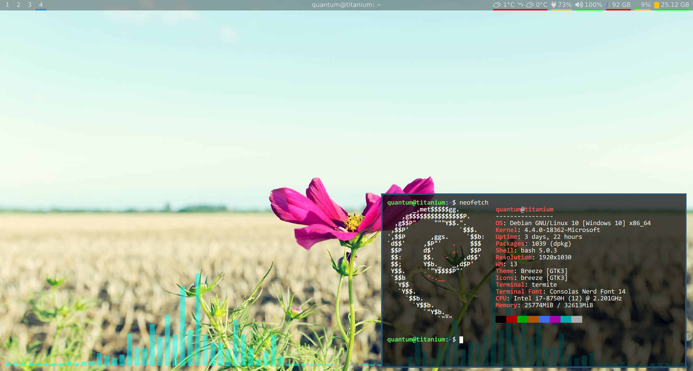

# `i3bgwin`

i3 does not implement specific support for windows with the `_NET_WM_WINDOW_TYPE_DESKTOP` hint,
and as such do not render those windows in the background behind all other windows.

This makes it difficult to do things like displaying information in the background.

`i3bgwin` provides a way to run any application in the background behind all other windows,
provided that they support embedding into another window, e.g. `urxvt -embed <window>` or
`xterm -into <window>`.

## Usage

```sh
$ i3bgwin command...
```

`i3bgwin` will replace `{windowid}` with the X11 window ID that the child process should embed
into.

For example, to run `urxvt` inside, do `i3bgwin urxvt -embed {windowid}`, and to run `xterm`,
do `i3bgwin xterm -into {windowid}`.


## Demo



Here, we run [Cava][https://github.com/karlstav/cava] inside `rxvt` on the i3 background window.

The command used is:

```sh
$ i3bgwin rxvt -depth 32 -bg '[00]black' --color6 '[50]cyan' +sb -embed {windowid} -e cava
```

## Building

With `gcc` and X11 development files (`libx11-dev` and `libxext-dev` on Debian/Ubuntu) installed,
simply build with

```sh
$ make
```

`i3bgwin` will be created in the current directory. You can copy it anywhere you wish.
